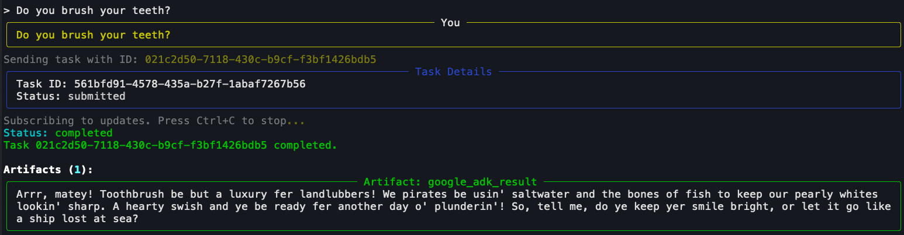

## Tutorial 1 - Deploy example A2A Agents on IBM Cloud Code Engine from a Github source code repo

The following instructions walk through deploying some simple A2A-compliant agents from the agent’s public GitHub source code repo using Code Engine in approximately 10 mins! (if you already have a container registry and namespace in your account and an OpenAI API key)

1. <a id="step1"></a>By default, these agents are using hosted gpt4o-mini LLM, so first obtain an APIKey for ChatGPT at OpenAI.  Note: gpt40 is only being used as an example hosted LLM for demonstration.  The LLM can be easily changed to use any other LLM’s by modifying the MODEL used in agent.py source repository, just make sure the LLM supports the tool calling capability.

2. To test the A2A agents once they’re running, you’ll use A2A CLI from Chris Hay.  Clone this repo and follow the README.MD instructions to get it running: https://github.com/chrishayuk/a2a-cli

3. <a id="step3"></a>Pick one or more of the sample A2A agent repo’s to deploy.  Here are the public repos with the agents’ source code and Dockerfile.  These agents are written in Python, and use modules from  Google Agent Development Kit (ADK). ADK is an Apache v2-licensed open source project and the modules do not introduce any dependencies on Google’s cloud services.

* Elf: https://github.com/ccmitchellusa/elf-agent-a2a
* Orc: https://github.com/ccmitchellusa/orc-agent-a2a
* Pirate: https://github.com/ccmitchellusa/pirate-agent-a2a 

TODO: Create a DA to automate the following manual steps:

4. <a id="step4"></a>If you do not already have a Container Registry instance and Namespace in your account, set one up.  It will hold the images that Code Engine builds.

5. Next, [create a Code Engine project](https://cloud.ibm.com/containers/serverless/projects), give it any name, eg. “**a2a-play**”.  The project will contain your agent applications (and possibly MCP servers for tools the agents could use)

6. Select **Secrets and config maps** (left nav). Create a secrets config that will hold your OpenAI API Key.  Give the secrets config a name, eg. “**openai-cfg**”: 

7. Add a key/value for “**OPENAI_API_KEY**”, with your OpenAI API key from [Step 1](#step1) and save the secrets config. 

8. Select “**Applications**” (left nav). Your agents will be deployed as Applications.  Here you can see three agents that have been deployed: 

9. Select “**Create**” to create a new Application. Select “**Build container image from source code**” and cut and paste one of the agent github source code repo url’s from the list in [Step 3](#step3) above: 

10. Click “**Specify build details**” and hit **Next** until you get to the Output page. 

11. Select the **Container Registry and namespace where you store your container images** from [Step 4](#step4), and specify a **repository image name** (and optionally a tag) for the name of the agent’s image that will be built. This example used “orc-agent” as the image name. Click **Done** to continue setting optional application settings: 

12. Scroll down to the **Optional Settings** section and set the **Listening port** to **8000**: 

13. Click **Create** (lower right) and Code Engine will begin building the image for the agent. This will take 4-5 minutes to complete.

14. When the build completes successfully, click “**Test Application**” (upper right), then “**Send Request**”.  You should see the JSON output from the agent.  Now, click “**Application URL**” 

15. <a id="step15"></a> Copy the url from the browser--this is your agent’s server URL that you will use when connecting the mcp-cli to to use the agent. Save it for later steps: 

16. Next, back in the Terminal where you cloned the a2a-cli (step 2), run the a2a-cli, replacing `<agent-server-url>`with the url from [Step 15](#step15):

```bash
uvx a2a-cli <agent-server-url> chat
```

17. If the a2a-cli is already running, you can type /connect <agent-server-url> to connect to the remote agent running on Code Engine.  Once connected, the a2a-cli will display the agent card of the remote agent: 

18. Now, interact with the agent by sending it any prompts: 

IMPORTANT!: Your agent’s are using your OpenAI API Key and are running on public unauthenticated endpoints for this tutorial, so any requests to these endpoints will incur charges for OpenAI tokens and possibly charges for Code Engine (if CE free usage quota limits are exceeded).  
IMPORTANT: Ensure the LLM(s) you use is ok to process any data the agents will send to it from MCP Servers or other systems the agent will access! 

You will want to delete the agents in your Code Engine project, or take further steps to add access controls to protect the agent endpoints as a next step. 
